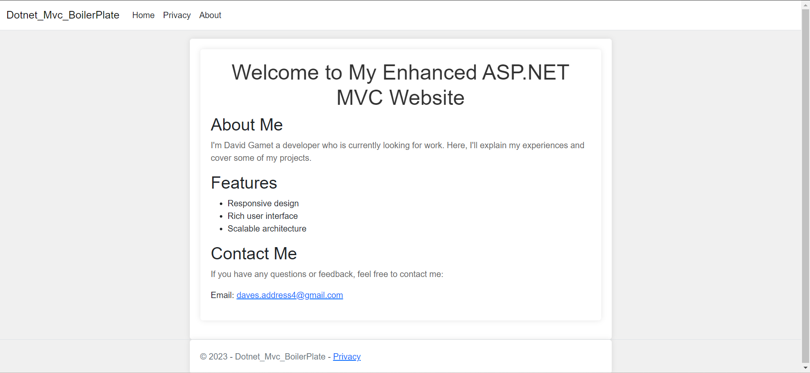

# My Dotnet-Mvc-BoilerPlate

Right now if you run this it will display the default page.

# How to run

Step 1: Install .NET by going to https://dotnet.microsoft.com/download/dotnet

Step 2: Make sure .NET is installed by typing into the terminal `dotnet --version` the version you downloaded should then appear.

If you don't know how to open the terminal and you are using VS Code just press `ctrl + backtick`  Also, make sure to install the C# dependencies. Microsoft has built an extension simply called C# and it works great.

Step 3: Type into your terminal `dotnet run` This will launch the application on your web browser.

Step 4: Press `ctrl + left click` on `http://localhost:5109` This is the default port for the default page I will have more to come!

Stay tuned for updates!